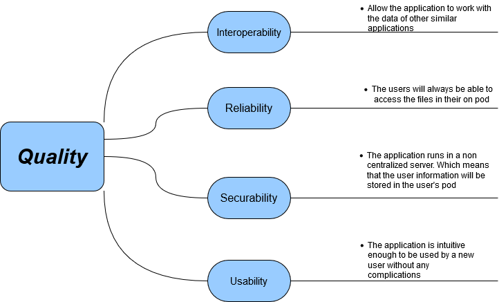

[[section-quality-scenarios]]
== Quality Requirements

After we discussed some more the design and the goals of this proyect some quality attributes that aren't as notable or important that the ones that we are focusing on came to light. Some of this includes attributes like usability, learnability or flexibility. This three, for example, constitute an integral part of every application and will be taken into consideration in a future stage of development.

=== Quality Tree

The tree below shows some of the quality attributes that we already discussed and decided to be relevant at this point of the development. In the future it is certain that this initial tree will be expanded upon or even altered.

=== Quality Scenarios

Unfortunately, at this stage in development we cannot ascertain the functionality and efficiency of the system. So this will be completed in the near future when we have a more solid understanding of our capabilities with the development tools that are available to us.
